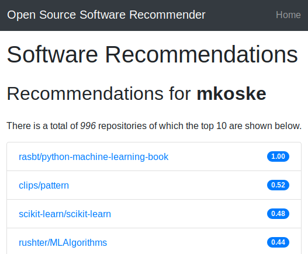

# Recommender

A coursework for TIETS43 Recommender Systems at University Of Tampere.



## General

The purpose of this coursework is to implement recommender system which recommends open source software repositories for user based on his Github metadata.

Github metadata currently include:

Repository **languages** and **topics** from

- users' own repositories
- starred repositories
- followed repositories

Data also includes both the `README` and `LICENSE` -files in `base64`-encoded format.

## Requirements

- Anaconda or Minicoda (or whatever Python distribution you like, but these are easiest, though)
- Git (if you want to clone the repository, otherwise you can just download the repository as ZIP-archive)
- Create new environment by running `conda env create --name recommender --file requirements.txt` in the repository root directory.
- Run `source activate recommender`to activate the environment

And now you're ready to use or contribute to the Recommender. For using the dataset retrieval and prerpocessing tools, see "Tools"-section of this README.

## Repository search

Using Github `search`-API, one can search repositories by license. Following query searches for repositories that uses one of these licenses:

- BSD 2-clause
- BSD 3-clause
- MIT

The query:

`?q=license:bsd-3-clause+license:bsd-2-clause+license:mit`

This should be way more than enough, since the query shows there are more than 2 700 00 repositories meeting this criteria.

Full API query:

`https://api.github.com/search/repositories?q=license:bsd-3-clause+license:bsd-2-clause+license:mit`

## Tools

There are four Python scripts that can be used to retrieve and vectorize the dataset. They are listed here and described below:

- `user.py`
- `data.py`
- `vectorize.py`
- `preprocess.py`
- `helper.py` (contains helper methods used in user and data retrieval scripts)

Before using these, do the following:

Make an environment variable called `GITHUB`, where you put your Github access-token.

- Login to your Github-account
- Go to [https://github.com/settings/tokens](https://github.com/settings/tokens)
- Create your personal access token
- Make an environment variable called `GITHUB` and store your token there

### Users

File `user.py` contains code to retrieve repository metadata for user to whom we're going to recommend other repositories. Result is saved in JSON-format.

Run `python code/user.py github-username` on your terminal and it will report what it is doing finally saving the results to `github-username.json`. For example:

```
$ cd recommender
$ python code/user.py mkoske
$ # ...
$ ls -lh
$ # ...
$ -rw-r--r-- 1 miika miika 392K marra 24 00:44 mkoske.json
```

### Data

Similar to `user.py`-script. An example below:

```
$ cd recommender
$ python code/data.py 50
$ # ...
$ ls -lh
$ # ...
$ -rw-r--r-- 1 miika miika 392K marra 24 00:44 data.json
```

Above example retrieves metadata on 50 repositories and stores it in JSON-format.

### Vectorize

This script is used to convert each repository to a vector and then store the result in CSV-format.

```
$ cd recommender
$ python code/vectorize.py output/<user>.json
$ python code/vectorize.py output/data.json
```

Of course, replace <user> with your target Github username.

### Preprocess

This script is used to apply a series of preprocessing steps to the README document texts of all the repositories. The output is two csv-files, `<user>_tok.csv` and `data_tok.csv` .

```
$ cd recommender
$ python code/preprocess.py output/<user>.csv output/data.csv
```

**NOTE:** The above step must be performed for `<user>.csv` and `data.csv` together. The `data_tok.csv` and `<user>_tok.csv` files are both specific to that user.

## Workflow

- Run `user.py` to get user profile
- Run `data.py` to get dataset
- Run `vectorize.py` to make CSV-files out of both JSON-files
- Run `preprocess.py`to tokenize all README files (must be done again when changing username)
- Run `./run.sh` in your local repository root directory to start the web app
- Navigate to http://localhost:5000 and enter `<user>` to get the recommendations.

## Dataset statistics

For the statistics of the dataset, please use the notebook found in `notebooks`-subdirectory.
